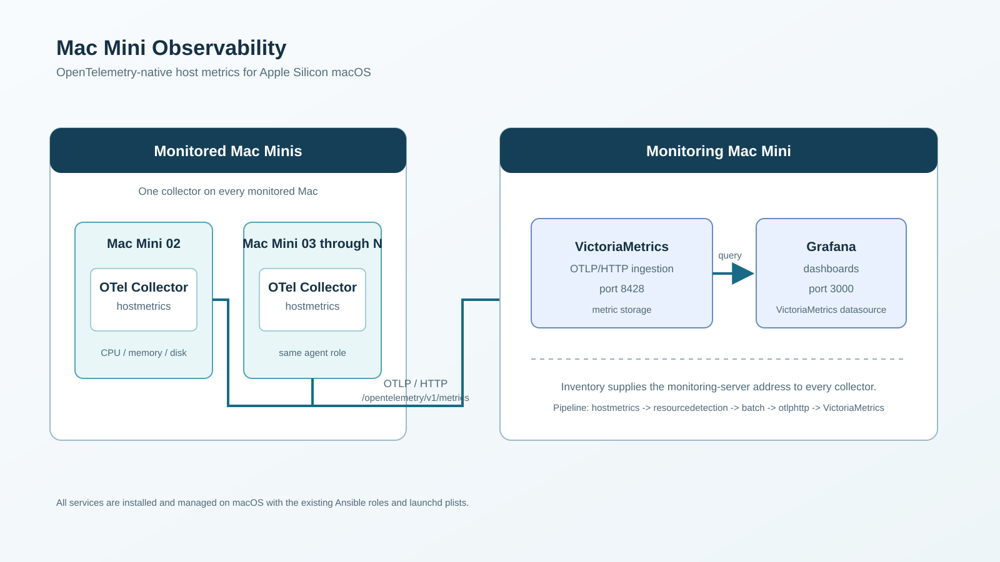

# Mac Mini Observability

Ansible automation for host-metric observability on Apple Silicon Mac Minis. One monitoring Mac Mini runs VictoriaMetrics and Grafana; every monitored Mac Mini runs an OpenTelemetry Collector.

## Architecture



The metric path is:

`hostmetrics -> resourcedetection -> batch -> otlphttp -> VictoriaMetrics -> Grafana`

Each collector sends OTLP/HTTP to `http://<monitoring-server-address>:8428/opentelemetry/v1/metrics`. There is no Prometheus server or Prometheus-specific Collector component in this design.

## Before deployment

You need:

- A control machine with Ansible installed and network access to the target Macs.
- Apple Silicon Macs running macOS, with SSH enabled.
- An Ansible SSH user on every Mac with sudo permission.
- One Mac selected as the monitoring server and at least one separate Mac selected as a monitored node.
- The hostname or reachable address, SSH user, and SSH authentication method for each Mac.
- Network access from monitored Macs to the monitoring Mac on port `8428`; browser access to Grafana on port `3000` as required.

Use SSH keys where possible. Confirm connectivity before deployment:

```bash
ansible all -i inventories/production/hosts.yml -m ping
```

## Prepare the inventory

Edit [inventories/production/hosts.yml](inventories/production/hosts.yml). Define exactly one host in `monitoring_server` and put each collector host in `monitored_nodes`.

```yaml
all:
  children:
    monitoring_server:
      hosts:
        monitoring-mac:
          ansible_host: <monitoring-mac-address>
          ansible_user: <ssh-user>
    monitored_nodes:
      hosts:
        agent-mac-01:
          ansible_host: <agent-mac-address>
          ansible_user: <ssh-user>
```

The agents derive `monitoring_server_address` from the monitoring-server inventory entry. Do not put real production addresses or credentials in source-controlled variable files.

## First-time setup: one monitoring Mac and one agent Mac

Start with one of each. Do not scale out until this flow succeeds on physical Macs.

1. **Prepare the monitoring Mac.** Confirm SSH and sudo access, and ensure ports `8428` and `3000` are available.
2. **Configure inventory.** Add the monitoring Mac and one agent as shown above.
3. **Secrets (optional).** No vault is required by default: `victoriametrics_auth_enabled: false` in `inventories/production/group_vars/all.yml`, and `grafana_admin_password` in `inventories/production/group_vars/monitoring_server.yml` is a plain, checked-in default (`admin`). This is meant for local/testing use — anyone who can reach port `8428` can read, write, or delete fleet metrics unauthenticated, and Grafana logs in with the default credentials.

   For anything beyond that, set real credentials, plain or vaulted:

   ```bash
   ansible-vault encrypt_string 'replace-with-a-strong-password' --name 'vault_grafana_admin_password'
   ansible-vault encrypt_string 'replace-with-a-strong-password' --name 'vault_victoriametrics_password'
   ```

   Set `grafana_admin_password: "{{ vault_grafana_admin_password }}"` and, if enabling VictoriaMetrics auth, `victoriametrics_auth_enabled: true` plus `victoriametrics_auth_password: "{{ vault_victoriametrics_password }}"`. Both the collector on every monitored Mac and the Grafana datasource are rendered with the VictoriaMetrics credentials, so all three must be deployed from the same source. Add `--ask-vault-pass` to the commands below if you vault either secret.
4. **Run the server setup.**

   ```bash
   ansible-playbook -i inventories/production/hosts.yml site.yml --tags server --ask-become-pass
   ```
5. **Verify VictoriaMetrics.** On the monitoring Mac, check `http://localhost:8428/health` and review `/opt/observability/var/log/victoriametrics.err.log` if it does not respond. `/health` is deliberately exempt from authentication. If you enabled auth, query endpoints are not exempt, so `curl -u observability:<password> http://localhost:8428/api/v1/labels` is the check that credentials are working, and an unauthenticated query correctly returns `401`.
6. **Verify Grafana.** Open `http://<monitoring-mac-address>:3000`, sign in with the configured password, and confirm the VictoriaMetrics datasource is present.
7. **Prepare the agent Mac.** Confirm SSH/sudo access and that it can reach the monitoring Mac on port `8428`.
8. **Run the agent setup.** Replace the limit with your agent inventory alias.

   ```bash
   ansible-playbook -i inventories/production/hosts.yml site.yml --limit agent-mac-01 --tags agent --ask-become-pass
   ```
9. **Verify the collector.** On the agent, run:

   ```bash
   sudo /opt/observability/bin/otelcol-contrib validate --config=/opt/observability/etc/otel-config.yaml
   ```

   Then review `/opt/observability/var/log/otelcol.err.log` if needed.
10. **Verify end-to-end metrics.** Confirm VictoriaMetrics remains healthy, then open the provisioned Grafana dashboard and check that the agent host appears.

## Scale to N Mac Minis

After the first monitoring-and-agent test works:

1. Add each additional Mac to `monitored_nodes` in the inventory, using its own placeholder-replaced address and SSH user.
2. Apply the same agent role to all monitored nodes:

   ```bash
   ansible-playbook -i inventories/production/hosts.yml site.yml --tags agent --ask-become-pass
   ```
3. Target one host during troubleshooting or staged rollout:

   ```bash
   ansible-playbook -i inventories/production/hosts.yml site.yml --limit agent-mac-02 --tags agent --ask-become-pass
   ```
4. Check the Grafana fleet dashboard for all hosts.

The `observability_agent` role is reused unchanged for any number of monitored Mac Minis, including a fleet of approximately 40.

## Versions and macOS compatibility

| Component | Version | Why this version matters |
| --- | --- | --- |
| OpenTelemetry Collector Contrib | `0.159.0` | **Minimum usable version on macOS.** In `0.98.0` the `hostmetrics` `cpu` and `disk` scrapers return `not implemented yet` on darwin and emit nothing, leaving the CPU and disk panels permanently empty. Do not downgrade without re-testing on a Mac. |
| VictoriaMetrics | `1.101.0` | Runs with `-opentelemetry.usePrometheusNaming`. Without that flag it stores OTLP names verbatim (`system.memory.usage`, label `host.name`) and every dashboard query returns nothing. Confirmed present in `1.101.0`'s flag list; see "Validation limits" below for what has and hasn't been run end-to-end at this version. |
| Grafana | `13.2.0` | Grafana 11+ removed the separate `grafana-server` binary; the launchd plist uses `grafana server` instead. |

Versions, checksums and tuning are role defaults under
`roles/<role>/defaults/main.yml`. Override them per environment in
`inventories/production/group_vars/`. Every download is checksum-verified
against the upstream-published SHA256, so a version bump also requires updating
the matching `*_checksum` value.

Each release installs into its own versioned directory with a stable symlink
(`/opt/observability/bin/otelcol-contrib`, `.../victoria-metrics-prod`,
`/opt/observability/grafana`), so upgrades are a symlink flip and the previous
version stays on disk for rollback.

## What the project installs

| Role | Target | Installed/configured components |
| --- | --- | --- |
| `observability_server` | `monitoring_server` | VictoriaMetrics, Grafana, datasource/dashboard provisioning, launchd plists |
| `observability_agent` | `monitored_nodes` | `otelcol-contrib`, host-metric pipeline, launchd plist |

Software, configuration, data, and logs are placed under `/opt/observability`. The project uses the existing macOS launchd approach with plists in `/Library/LaunchDaemons`.

## Troubleshooting

| Problem | First checks |
| --- | --- |
| SSH or Ansible cannot connect | Confirm `ansible_host`, `ansible_user`, SSH keys, and `ansible all -m ping`. |
| Collector does not start | Validate `/opt/observability/etc/otel-config.yaml`; inspect `otelcol.err.log`; confirm the collector binary exists. |
| VictoriaMetrics does not start | Check the binary, port `8428`, and `victoriametrics.err.log`. |
| Grafana does not start | Check the binary, port `3000`, configuration path, and `grafana.err.log`. |
| Metrics do not appear | Check the collector log, agent-to-server access on `8428`, VictoriaMetrics health, then Grafana datasource/dashboard. |
| launchd or plist issue | Use [LAUNCHD_TROUBLESHOOTING.md](LAUNCHD_TROUBLESHOOTING.md) for plist validation, service status, logs, and safe recovery commands. |
| Incorrect path or port conflict | Compare the plist `ProgramArguments` with the files under `/opt/observability`; use `lsof` to identify a listener on ports `8428` or `3000`. |

## Security

- Never commit real passwords, private keys, or credentials.
- Use Ansible Vault for the Grafana password and any other secret values.
- Keep inventory addresses environment-specific and avoid hard-coding production infrastructure into roles or templates.
- Restrict SSH, sudo access, and network exposure of ports `8428` and `3000` to the required users and networks.

## Validation limits

The **data path** has been validated on Apple Silicon by running the real
binaries locally: collector `0.159.0` scraping `hostmetrics`, exporting OTLP/HTTP
with basic auth into VictoriaMetrics `1.150.0`, and Grafana `13.2.0` rendering
this project's provisioned datasource and dashboard. All six dashboard panels
return data through Grafana's datasource proxy.

The pinned VictoriaMetrics default has since moved to `1.101.0` (to match an
already-downloaded local archive) and has **not** been through this same
end-to-end run — only confirmed to expose `-opentelemetry.usePrometheusNaming`
in its flag list. Re-verify the dashboard panels after deploying with it.

What that does **not** cover, and still requires physical Mac Minis:

- launchd bootstrap, `KeepAlive` and restart behaviour for all three services.
- Running as root under launchd rather than as a logged-in user.
- File ownership (`root:wheel`) and the `0600` secret files at runtime.
- Network and firewall policy between monitored Macs and the monitoring Mac.
- Idempotency across repeated playbook runs on real hosts.

This project must not be considered production-tested until the
one-monitoring-Mac plus one-agent-Mac test succeeds on real hardware.

## More documentation

- [Project internal flow](docs/PROJECT_FLOW.md)
- [Confluence-ready project overview](docs/project-overview.md)
- [launchd troubleshooting](LAUNCHD_TROUBLESHOOTING.md)
