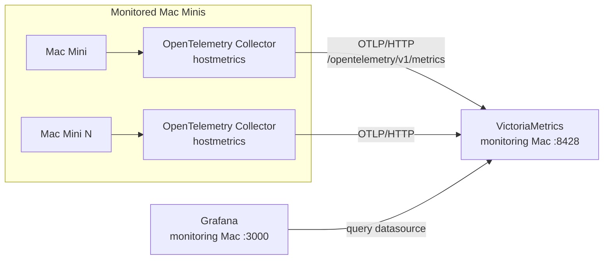
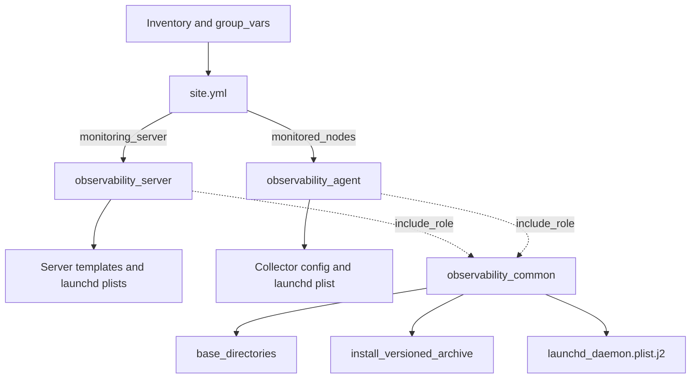

# Project Flow

## Overview

This project automates host-metric observability for Apple Silicon Mac Minis. It has two applied Ansible roles: `observability_server` configures one monitoring Mac Mini, and `observability_agent` configures every monitored Mac Mini. The same agent role is reused as the fleet grows.

A third role, `observability_common`, is a library rather than something applied to hosts. It holds the parts both roles would otherwise duplicate three times over: the `/opt/observability` directory layout, the download → checksum → versioned-extract → verify install flow, and one launchd plist template shared by all three daemons. Both roles pull these in with `ansible.builtin.include_role` and `tasks_from`.

The shared install flow deliberately stops before creating the stable symlink and before notifying any restart handler. The symlink flip is the moment a service's running version actually changes, so it stays in the calling role beside the handler it triggers.

## Overall architecture



The collector is deliberately the host-metric agent. It collects data on a Mac, adds resource identity, batches data, and delivers it directly to VictoriaMetrics with OTLP/HTTP. Grafana reads the stored data through its provisioned VictoriaMetrics datasource.

## Inventory and playbook flow

`inventories/production/hosts.yml` defines two groups:

- `monitoring_server`: exactly one central Mac Mini.
- `monitored_nodes`: every Mac Mini that should send host metrics.

Variables are split by ownership:

- `roles/<role>/defaults/main.yml` holds versions, checksums, install paths, ports and tuning. Each role is self-contained and can be run against a different inventory.
- `group_vars/all.yml` holds only the **cross-role contract** - `victoriametrics_port`, `monitoring_server_address`, and the VictoriaMetrics authentication settings. These must agree between the monitoring Mac and every agent, so they are defined exactly once.
- `group_vars/<group>.yml` holds vault secret references and per-environment overrides.

`monitoring_server_address` is derived from the first host in `monitoring_server`; this is how agents receive the destination address without a hard-coded server address. The agent role asserts that this group contains exactly one host with `ansible_host` set, so a misconfigured inventory fails with a clear message instead of an index error.



`site.yml` has one play for each inventory group. Tags allow the server play (`--tags server`) and agent play (`--tags agent`) to be run independently.

## Monitoring Mac flow

The `observability_server` role imports tasks in this order:

1. `prerequisites.yml` creates `/opt/observability` directories for binaries, configuration, data, plugins, and logs.
2. `victoriametrics.yml` writes the `0600` basic-auth password file, downloads and checksum-verifies the archive, extracts it into a versioned directory, repoints the `victoria-metrics-prod` symlink, renders its plist, and requests service start.
3. `grafana.yml` extracts Grafana into a versioned directory, repoints the `/opt/observability/grafana` symlink, renders `grafana.ini`, provisions the VictoriaMetrics datasource and dashboard, renders its plist, and requests service start.
4. `flush_handlers` applies any pending restarts **before** verification, so the checks below see the configuration this run just produced rather than the previous one.
5. `verify.yml` checks VictoriaMetrics health, that its query API accepts the configured credentials and rejects unauthenticated access, Grafana health, the Grafana datasource API, and that the fleet dashboard was provisioned.

The VictoriaMetrics plist points to `/opt/observability/bin/victoria-metrics-prod`, stores data in `/opt/observability/var/victoriametrics`, logs under `/opt/observability/var/log`, and listens on the shared port variable (default `8428`). Grafana's plist runs `/opt/observability/grafana/bin/grafana server` (Grafana 11+ removed the separate `grafana-server` binary); its configuration, data, plugin, and log paths agree with the rendered `grafana.ini`.

## Monitored Mac flow

The `observability_agent` role imports tasks in this order:

1. `prerequisites.yml` asserts the `monitoring_server` group is usable, then creates the shared directory structure.
2. `opentelemetry.yml` downloads and checksum-verifies the Darwin ARM64 `otelcol-contrib` archive, extracts it into a versioned directory, asserts the binary exists, repoints the `/opt/observability/bin/otelcol-contrib` symlink, renders the `0600` collector configuration and the plist, and requests service start.
3. `flush_handlers` applies the pending restart before verification.
4. `verify.yml` checks reachability to the monitoring server, runs `otelcol-contrib validate` against the rendered configuration, and then waits for host metrics to actually appear in VictoriaMetrics before reporting the hosts currently reporting.

The collector plist starts the same binary and configuration that the role renders:

```text
/opt/observability/bin/otelcol-contrib
--config=/opt/observability/etc/otel-config.yaml
```

## Collector pipeline

The generated collector configuration has one metrics pipeline:

```text
hostmetrics -> resourcedetection -> batch -> otlphttp -> VictoriaMetrics
```

| Stage | What it does | Why it is used |
| --- | --- | --- |
| `hostmetrics` | Scrapes CPU, memory, disk, filesystem, network, and load data from macOS. | Provides host telemetry without an additional host agent. |
| `resourcedetection` | Detects system resource attributes, including the OS hostname. | Associates metrics with the Mac that emitted them. |
| `batch` | Groups telemetry before export. | Reduces individual export operations. |
| `otlphttp` | Sends metric payloads over OTLP/HTTP. | Uses VictoriaMetrics' OpenTelemetry ingestion endpoint. |
| `basicauth` | Attaches basic-auth credentials to the export. | VictoriaMetrics rejects unauthenticated writes when `victoriametrics_auth_enabled` is true. |

VictoriaMetrics runs with `-opentelemetry.usePrometheusNaming`. Without that flag it stores OTLP metric names verbatim, dots included (`system.memory.usage`, label `host.name`), and every dashboard query returns nothing.

The exporter endpoint is rendered from variables as:

```text
http://<monitoring_server_address>:<victoriametrics_port>/opentelemetry/v1/metrics
```

VictoriaMetrics persists the metric data. The Grafana dashboard queries VictoriaMetrics for host CPU, memory, filesystem, and network views.

## Variables into templates

Ansible loads inventory and group variables for the target host, then renders Jinja2 templates with those values. For example:

1. The agent obtains `monitoring_server_address` from `group_vars/all.yml`.
2. It also obtains `victoriametrics_port` from the shared variables.
3. `otel-config.yaml.j2` inserts both into the OTLP/HTTP metric endpoint.
4. `otelcol.plist.j2` inserts `bin_dir`, `etc_dir`, and `log_dir` into `ProgramArguments` and log paths.

The same pattern connects server variables to the VictoriaMetrics and Grafana plists and configuration templates. This centralizes environment values and prevents the roles from embedding real infrastructure addresses.

## launchd integration

The roles render system LaunchDaemon plists in `/Library/LaunchDaemons` for:

- `com.observability.victoriametrics`
- `com.observability.grafana`
- `com.observability.otelcol`

The current tasks and handlers use `ansible.builtin.service` to start, enable, and restart these labels. This is the current implementation, not a claim of tested runtime behavior. For diagnostics and a future, controlled `launchctl` refactor path, see [LAUNCHD_TROUBLESHOOTING.md](../LAUNCHD_TROUBLESHOOTING.md).

## First Mac test flow

1. Put one monitoring Mac and one agent Mac in their respective inventory groups.
2. Deploy the server play and confirm VictoriaMetrics health and Grafana access.
3. Deploy the agent play and validate the collector configuration.
4. Confirm the agent can reach port `8428` on the monitoring Mac.
5. Confirm metrics arrive and appear in Grafana.
6. Re-run the same plays to assess idempotency and observe launchd behavior.

This is the required validation point before scaling. The project has not been validated on real macOS hardware yet.

## Scaling flow

After the first test works, add more hosts under `monitored_nodes` and run the agent play against that group. To stage a deployment or investigate one Mac, use `--limit <inventory-alias>`. No new role or pipeline is required for additional nodes; inventory membership determines where the existing agent role runs.

## Failure and troubleshooting flow

Start at the layer nearest the failure:

1. **Ansible access:** verify inventory address, SSH user, key access, sudo, and `ansible all -m ping`.
2. **Installation paths:** verify binaries and generated configuration under `/opt/observability`.
3. **Service process:** inspect the relevant launchd label and stdout/stderr logs.
4. **Network:** verify agent access to the monitoring Mac on port `8428`; check server port conflicts.
5. **Data:** check VictoriaMetrics health, then the Grafana datasource and dashboard.

Use the dedicated [launchd troubleshooting guide](../LAUNCHD_TROUBLESHOOTING.md) for plist validation, `launchctl` commands, logs, and common service failures.

## Automated and manual responsibilities

| Automated by Ansible | Requires operator or real-Mac validation |
| --- | --- |
| Directory creation, downloads, archive extraction, template rendering, dashboard/datasource provisioning, and service requests | Inventory values, SSH and sudo access, Vault secret handling, network/firewall policy, launchd runtime behavior, and confirmation of end-to-end metrics |

Before physical Macs are available, static checks can validate YAML, Jinja templates, XML, JSON, variable references, and Ansible syntax when installed. Runtime behavior requires the first physical monitoring-and-agent test.
